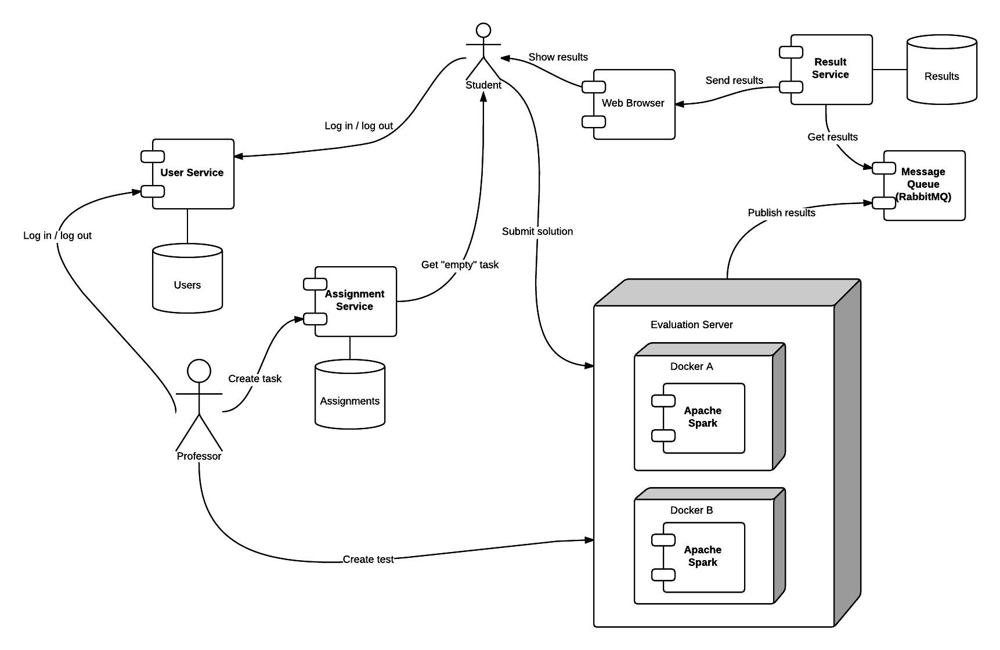

## Spis treści

- [Cel projektu](#cel-projektu)
- [Stos technologiczny](#stos-technologiczny)
- [Architektura](#architektura)
- [Techniki komponentowe](#techniki-komponentowe)

### Cel projektu

Celem projektu Testify jest stworzenie platformy, która umożliwi udostępnianie szkieletów zadań, pobieranie ich oraz dodawania rozwiązań do wspomnianych zadań. Po wrzuceniu zadania zostanie ono zbudowane odpowiednio przygotowanym skryptem oraz uruchomione z zestawem testów. Na podstawie wyników tych testów użytkownik uzyska informację zwrotną na temat poprawności wykonania zadania. Dodatkowo będzie możliwość stworzenia rankingów najlepszych zadań.

### Stos technologiczny
- Java 8
- Spring MVC
- Spring Boot
- Spring Cloud
- Spring AOP
- Apache Spark
- Docker
- PostgreSQL
- MongoDB

### Architektura

Cały system będzie składał się z dwóch modułów. Jeden będzie odpowiedzialny za komunikację z użytkownikiem oraz dostarczanie mu wszytskich podstawowych funkcjonalności (jak np. logowanie się do systemu itp.) oraz z modułu, który będzie przygotowywał środowisko i uruchamiał w nim załadowane przez użytkownika zadanie. Następnie będzie on zwracał wyniki do pierwszego modułu, który będzie je interpretował oraz przetwarzał w celu przedtstawienia ich użytkownikom. Drugi moduł będzie mógł być uruchomiony w wielu instancjach co pozwoli na równoległe wykonywanie wielu zadań.

*Rys. 1 Architektura*

Rys. 1 prezentuje planowaną architekturę systemu oraz komunikację klientów i poszczególnych komponentów. Wyróżniamy dwóch użytkowników:
- Prowadzący (Professor) - tworzy zadania i publikuje "szkielety" kodu w systemie, przygotowuje testy, które rozwiązanie powinno zaliczyć oraz schemat punktacji,
- Student - pobiera przygotowane przez Prowadzącego zadania. Po ich rozwiązadniu wysyła kod do systemu. Wyniki zwrócone przez system sprawdza w przeglądarce internetowej.

Część serwerowa składa się z 3 mikroserwisów i Środowiska Wykonawczego (Evaluation server). Serwisy (każdy ma swoją bazę danych zaznaczoną w nawiasie):
- User service (PostgreSQL) - umożliwia logowanie do systemu, przydziela token sesji,
- Assignment Service (MongoDB) - umożliwia dodawanie/pobieranie zadań oraz odbiera rozwiązania od Studenta,
- Result Service (PostgreSQL) - umożliwia pobieranie informacji o wynikach za zadania dla poszczególnych Studentów.

Środowisko Wykonawcze to komponent odpowiedzialny za uruchamianie i ocenę rozwiązań (w postaci plików .jar) nadesłanych przez Studentów. Na nadesłanym kodzie wykonuje szereg operacji:
- przepuszczenie przez testy przygotowane przez Prowadzącego,
- pomiar czasu rozwiązania, co umożliwi tworzenie list rankingowych,
- wykrywanie plagiatów w porównaniu do rozwiązań innych Studentów (opcjonalne).

### Techniki komponentowe
- Spring MVC - podstawowy framework, który zostanie użyty. W ramach projektu ma powstać także aplikacja webowa, służąca jako interfejs dla użytkownika,
- AOP - programowanie aspektowe wykorzystamy do logowania informacji oraz do implementacji systemu rozszerzeń - tj. definicji operacji, które Środowisko Wykonawcze wykona na nadesłanym rozwiązaniu. 
